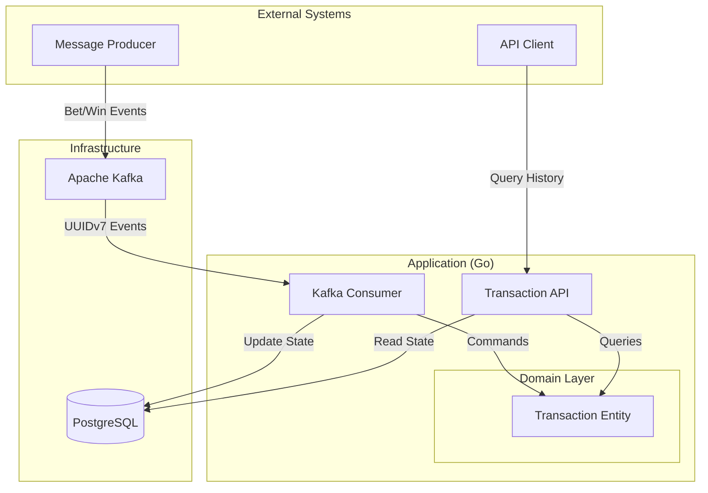

# Casino Transaction Management System

A high-performance, idempotent transaction management system built with Go 1.26+, Kafka, and PostgreSQL. It tracks user bets and wins, processing them asynchronously and providing a queryable REST API.

## Goals

* **Idempotent processing**: Ensure every Kafka message (bet/win event) is processed exactly once by using UUIDv7 as deterministic primary keys.
* **Financial Precision**: Prevent rounding errors by storing all amounts in minor units (e.g., cents) as integers.
* **Performance**: Optimize for high-throughput ingestion and low-latency historical queries using cursor-based pagination.
* **Type Safety**: Leverage code generation for database access (sqlc) and API contracts (oapi-codegen).

## Non-Goals

* **Balance Management**: This system records transactions but does not maintain or calculate real-time user balances.
* **Authentication/Authorization**: Intended to be handled by an API Gateway or reverse proxy; the service itself is internal-only.
* **Multi-Currency Support**: Currently only supports a single currency based on the provided minor units.

## Architecture

The system follows **DDD-Lite**, **CQRS**, and **Clean Architecture** principles to ensure high testability, maintainability, and clear separation of concerns.

### System Overview



### Key Architectural Decisions

* **Idempotency**: Uses Producer-generated **UUIDv7** as primary keys to ensure that the same event is never processed twice [[ADR-002]](docs/adr/ADR-002-choose-kafka-and-idempotent-message-processing.md).
* **Precision**: Financial amounts are stored as `BIGINT` (minor units/cents) to avoid floating-point errors [[ADR-004]](docs/adr/ADR-004-database-schema-and-indexing.md).
* **Scalability**: PostgreSQL uses **range partitioning** based on UUIDv7 for efficient time-based data distribution and pruning [[ADR-004]](docs/adr/ADR-004-database-schema-and-indexing.md).
* **Performance**: Cursor-based pagination for history queries to ensure stable performance as data grows [[ADR-004]](docs/adr/ADR-004-database-schema-and-indexing.md).

For more details, see the [Architecture Decision Records (ADRs)](docs/adr/README.md).

## Technology Stack

* **Language**: [Go 1.26+](https://go.dev/)
* **API**: Standard `net/http` with [OpenAPI 3.1](https://www.openapis.org/) support
* **Database**: [PostgreSQL 18](https://www.postgresql.org/) (with range partitioning) [[ADR-001]](docs/adr/ADR-001-choose-postgresql-for-transaction-storage.md)
* **Message Broker**: [Apache Kafka 4.2.0](https://kafka.apache.org/) (KRaft mode) [[ADR-002]](docs/adr/ADR-002-choose-kafka-and-idempotent-message-processing.md)
* **Persistence**: [sqlc](https://sqlc.dev/) for type-safe SQL queries
* **Migration**: [dbmate](https://github.com/amacneil/dbmate) for database versioning
* **API Spec**: [oapi-codegen](https://github.com/oapi-codegen/oapi-codegen) for Go server generation
* **CLI Framework**: [Cobra](https://github.com/spf13/cobra) + [Viper](https://github.com/spf13/viper) for configuration
* **Logging**: [slog](https://pkg.go.dev/log/slog) with [zerolog](https://github.com/rs/zerolog) backend for structured JSON output
* **Container Orchestration**: Docker Compose for development and production

## Project Structure

```text
├── api/                    # OpenAPI specifications and generated code
│   └── openapi.yaml        # OpenAPI 3.1 specification
├── cmd/                    # CLI entry points (api, consumer, seeder)
│   ├── api.go              # HTTP API server
│   ├── consumer.go         # Kafka consumer service
│   ├── seeder.go           # Sample data generator
│   └── root.go             # Cobra root command
├── docs/                   # Documentation
│   ├── adr/                # Architecture Decision Records
│   └── requirements.md     # Original requirements
├── internal/
│   └── transactions/
│       ├── domain/         # Core business logic & entities
│       ├── app/            # Use cases (Commands & Queries)
│       ├── ports/          # HTTP handlers, Kafka consumers
│       └── adapters/
│           └── postgres/
│               ├── db/          # sqlc-generated code
│               ├── migrations/  # dbmate migration files
│               ├── queries/     # sqlc query definitions
│               └── schema.sql   # Generated schema file
├── sqlc.yaml               # sqlc configuration
├── compose.yaml            # Production Docker Compose
├── compose.dev.yaml        # Development Docker Compose
├── Dockerfile              # Multi-stage production build
└── .air.toml               # Air hot reload configuration
```

## Getting Started

### Prerequisites

* Docker and Docker Compose (required)
* Go 1.26+ (optional, for local development without Docker)
* `make` (optional, for development workflow)

### Quick Start with Docker (Recommended)

1. **Clone the repository**:

    ```bash
    git clone <repository-url>
    cd altenar-test
    ```

2. **Create environment file**:

    ```bash
    cp .env.example .env
    # Edit .env with your values
    ```

    **Note:** `.env` is gitignored for security. Use `.env.example` as a reference.

3. **Start the environment**:

    ```bash
    make up
    ```

    This starts Kafka, PostgreSQL, the API service, and the Kafka Consumer.

4. **Verify services are running**:

    ```bash
    make logs  # View all logs or `make [api|consumer|postgres|kafka]-logs` for certain service
    curl http://localhost:8080/v1/health  # Health check
    ```

5. **Seed sample data**:

    ```bash
    make seed
    ```

    This produces sample bet/win events to Kafka to be processed by the consumer.

6. **Query transactions**:

    ```bash
    curl http://localhost:8080/v1/transactions  # List all transactions
    curl "http://localhost:8080/v1/transactions?transaction_type=bet"  # Filter by type
    ```

### Development Workflow with Docker

The project supports hot reload for development using **Air** with Docker Compose:

```bash
# Start development environment with hot reload
make dev

# View logs
make logs

# Services will automatically reload on code changes
```

**Development vs Production Setup:**

| Feature | Development (`make dev`) | Production (`make up`) |
|---------|-------------------------|------------------------|
| Hot Reload | ✅ Enabled (Air) | ❌ Static binary |
| Network | ✅ Ports exposed (API: 8080) | ❌ Internal only (use proxy) |
| Build | Source mounted with volume | Multi-stage build |
| Logs | Real-time with colors | Structured JSON (`slog`) |

**Production Note:** Docker services is not exposed to the public internet by default (only `api` service via `CASINO_HTTP_EXPOSED_PORT`). It should be positioned behind a reverse proxy (e.g., Nginx, Envoy) for enhanced security and load balancing.

### Makefile Commands

**Environment Management:**

* `make up`: Start all services via Docker Compose (production mode).
* `make down`: Stop all services.
* `make dev`: Start development environment with hot reload.
* `make logs`: View all service logs.

**Service Management:**

* `make api`, `make consumer`, `make postgres`, `make kafka`: Start individual services.
* `make api-dev`, `make consumer-dev`: Start services in development mode.
* `make api-logs`, `make consumer-logs`: View service-specific logs.

**Testing & Quality:**

* `make test`: Run unit tests (target: >85% coverage).
* `make test-coverage`: Run tests and generate HTML coverage report.
* `make lint`: Run golangci-lint (if installed).

**Code Generation:**

* `make generate`: Run sqlc and oapi-codegen [[ADR-003]](docs/adr/ADR-003-adopt-ddd-lite-with-cqrs-and-clean-architecture.md).
* `make migrate`: Apply database migrations.
* `make migrate-down`: Rollback database migrations.

**Data Management:**

* `make seed`: Send sample events to Kafka. This uses the `seeder` tool to generate realistic transaction data.

#### Configuring the Seeder

The seeder can be customized using environment variables in your `.env` file:

| Variable | Description | Default |
|----------|-------------|---------|
| `CASINO_SEEDER_COUNT` | Number of messages to generate | `10` |
| `CASINO_SEEDER_USER_IDS` | Comma-separated list of user IDs to randomize | `user1,user2,user3` |
| `CASINO_SEEDER_AMOUNT` | Maximum random amount (in minor units) | `500` |
| `CASINO_KAFKA_TOPIC` | Target Kafka topic | `transactions` |

#### Why the Seeder is implemented this way

The seeder is not just a simple script; it's a built-in CLI command (`casino seeder`) designed to:

1. **Validate UUIDv7 Logic**: Since the system relies on UUIDv7 for range partitioning and idempotency, the seeder uses the same generation logic as a production producer would.
2. **Test Idempotency**: By running the seeder multiple times or with specific IDs, you can verify that the consumer correctly ignores duplicate events.
3. **Realistic Load**: It generates a mix of `bet` and `win` types with random amounts to simulate diverse traffic patterns.
4. **Integration Testing**: Because it runs as a container within the `casino_net` network, it tests the actual Kafka connectivity and schema compatibility used in production.

**Individual Service Commands:**

```bash
make [service]          # Start service in production mode
make [service]-dev      # Start service in development mode
make [service]-logs     # View logs for a specific service
```

**Available Services:** `api`, `consumer`, `postgres`, `kafka`, `kafka_init`

### Environment Variables

Key environment variables (see `.env.example` or `compose.yaml` for full list):

| Variable | Description | Default |
|----------|-------------|----------|
| `CASINO_DB_HOST` | PostgreSQL host | `casino_postgres` |
| `CASINO_DB_NAME` | Database name | `casino` |
| `CASINO_DB_USER` | Database user | `casino` |
| `CASINO_DB_PASS` | Database password | (required) |
| `CASINO_HTTP_PORT` | API HTTP port | `8080` |
| `CASINO_KAFKA_URL` | Kafka broker URL | `casino_kafka:9092` |
| `CASINO_KAFKA_TOPIC` | Kafka topic name | `transactions` |
| `CASINO_LOG_LEVEL` | Log level (`debug`, `info`, `warn`, `error`) | `info` |
| `CASINO_LOG_FORMAT` | Log format (`json`, `text`) | `json` |

## API Documentation

The API follows the OpenAPI 3.1 specification found in `api/openapi.yaml`.

### Main Endpoints

| Method | Endpoint | Description |
| :--- | :--- | :--- |
| `GET` | `/v1/transactions` | List all transactions with optional filtering. |
| `GET` | `/v1/health` | Health check endpoint. |

**Query Parameters (`/v1/transactions`):**

* `user_id`: Filter by unique identifier of the user.
* `transaction_type`: Filter by `bet` or `win`.

**Example Requests:**

**Health Check**

```bash
curl -i http://localhost:8080/v1/health
```

Response:

```json
{
  "status": "healthy"
}
```

**List all transactions**

```bash
curl -i http://localhost:8080/v1/transactions?page_size=2
```

Response:

```json
{
 "has_more": true,
 "next_cursor": "019d4817-b9cc-7f16-a5b8-aebdbf3f266d",
 "transactions": [
  {
   "amount": 96,
   "id": "019d4817-b9ce-79bc-be42-8a44f346aec9",
   "timestamp": "2026-04-01T08:10:02.47374Z",
   "transaction_type": "bet",
   "user_id": "user_1"
  },
  {
   "amount": 91,
   "id": "019d4817-b9cc-7f16-a5b8-aebdbf3f266d",
   "timestamp": "2026-04-01T08:10:02.473739Z",
   "transaction_type": "bet",
   "user_id": "user_2"
  }
 ]
}
```

**Filter by transaction type**

```bash
curl -i "http://localhost:8080/v1/transactions?transaction_type=bet&page_size=2"
```

**Filter by user ID**

```bash
curl -i "http://localhost:8080/v1/transactions?user_id=user_3&page_size=2"
```

**Error Response (Invalid Type)**

```bash
curl -i "http://localhost:8080/v1/transactions?transaction_type=invalid"
```

Response:

```json
{
 "code": "INVALID_TRANSACTION_TYPE",
 "message": "unsupported transaction type \"invalid\": transaction type must be 'bet' or 'win'"
}
```

## Code Generation

The project uses **code generation** to ensure type-safety and reduce boilerplate. This is a core part of the [DDD-Lite with CQRS architecture](docs/adr/ADR-003-adopt-ddd-lite-with-cqrs-and-clean-architecture.md).

### Generated Components

| Tool | Purpose | Input | Output |
|------|---------|-------|--------|
| **sqlc** | Type-safe SQL queries | `.../postgres/queries/*.sql` | Go database access layer |
| **dbmate** | Database migrations | `.../postgres/migrations/*.sql` | Updates `schema.sql` |
| **oapi-codegen** | HTTP handlers & types | `api/openapi.yaml` | Go server/client code |
| **mockery** | Mock generation for testing | `.mockery.yml` | `mocks.go` files in internal packages |

### Code Generation Workflow

**When to regenerate:**

* Modified SQL query files
* Updated OpenAPI specification
* Changes to database schema in migrations
* After adding or modifying a Go interface that requires testing

**How to regenerate:**

```bash
make generate
```

This command runs:

1. `go generate ./...` - Triggers oapi-codegen
2. `sqlc generate` - Generates database access layer
3. `mockery` - Generates interface mocks for testing

*Note: dbmate automatically generates/updates the `schema.sql` file after migrations are run, which is then used by sqlc.*

### Generated Code Structure

```text
internal/transactions/adapters/postgres/
├── db/                      # sqlc-generated code (DO NOT EDIT DIRECTLY)
│   ├── models.go            # Go structs for database tables
│   └── transactions.sql.go  # Type-safe query methods
└── schema.sql               # Generated schema (for sqlc)

api/
├── openapi.yaml             # Source OpenAPI spec
└── openapi.gen.go           # Generated HTTP handlers & types (DO NOT EDIT)
```

**Important:** Generated files should be committed to version control but never edited manually. Changes should be made to the source files and regenerated.

## Testing

### Running Tests

The project aims for >85% test coverage [[ADR-003]](docs/adr/ADR-003-adopt-ddd-lite-with-cqrs-and-clean-architecture.md).

```bash
# Run all tests
make test

# Generate coverage report
make test-coverage
```

**Coverage Report Location:**

* Console summary: `make test-coverage` output
* HTML report: `coverage.html` (open in browser)

### Test Types

| Test Type | Location | Purpose |
|-----------|----------|---------|
| Unit tests | `internal/transactions/domain/` | Pure business logic (no dependencies) |
| Integration tests | `internal/transactions/adapters/` | Database/Kafka interactions |

## Development

### Linting

```bash
make lint
```

**Note:** `golangci-lint` must be installed locally. If not installed, the command skips gracefully.

### Local Development Setup

For full IDE support with code generation:

1. **Install Go tools locally:**

   ```bash
   go install github.com/oapi-codegen/oapi-codegen/v2/cmd/oapi-codegen@latest
   go install github.com/vektra/mockery/v3@latest
   go install github.com/sqlc-dev/sqlc/cmd/sqlc@latest
   ```

2. **Regenerate after schema changes:**

   ```bash
   make generate
   ```

3. **Run tests to verify:**

   ```bash
   make test
   ```

## Future Improvements

Based on the current goals and architecture, the following areas are identified for future enhancement:

* **Observability & Monitoring**: Integrate **Prometheus** for real-time metrics (e.g., message processing latency, error rates) and **OpenTelemetry** for distributed tracing across Kafka and the API.
* **Balance Service Integration**: Implement a separate service that consumes transaction events via **Change Data Capture (CDC)** from PostgreSQL to maintain real-time user balances.
* **Multi-Currency Support**: Extend the domain model and database schema to support multiple currencies with exchange rate handling, while maintaining financial precision.
* **Enhanced Querying**: Implement search and filtering using **Elasticsearch** or specialized OLAP databases for complex analytical queries that go beyond simple history retrieval.
* **Rate Limiting & Security**: Add API rate limiting and integrate with an OIDC provider (e.g., Keycloak) for secure, authenticated access in a production environment.
* **Automated Performance Testing**: Integrate periodic load testing (e.g., using k6) into the CI/CD pipeline to ensure the system meets high-throughput requirements.
